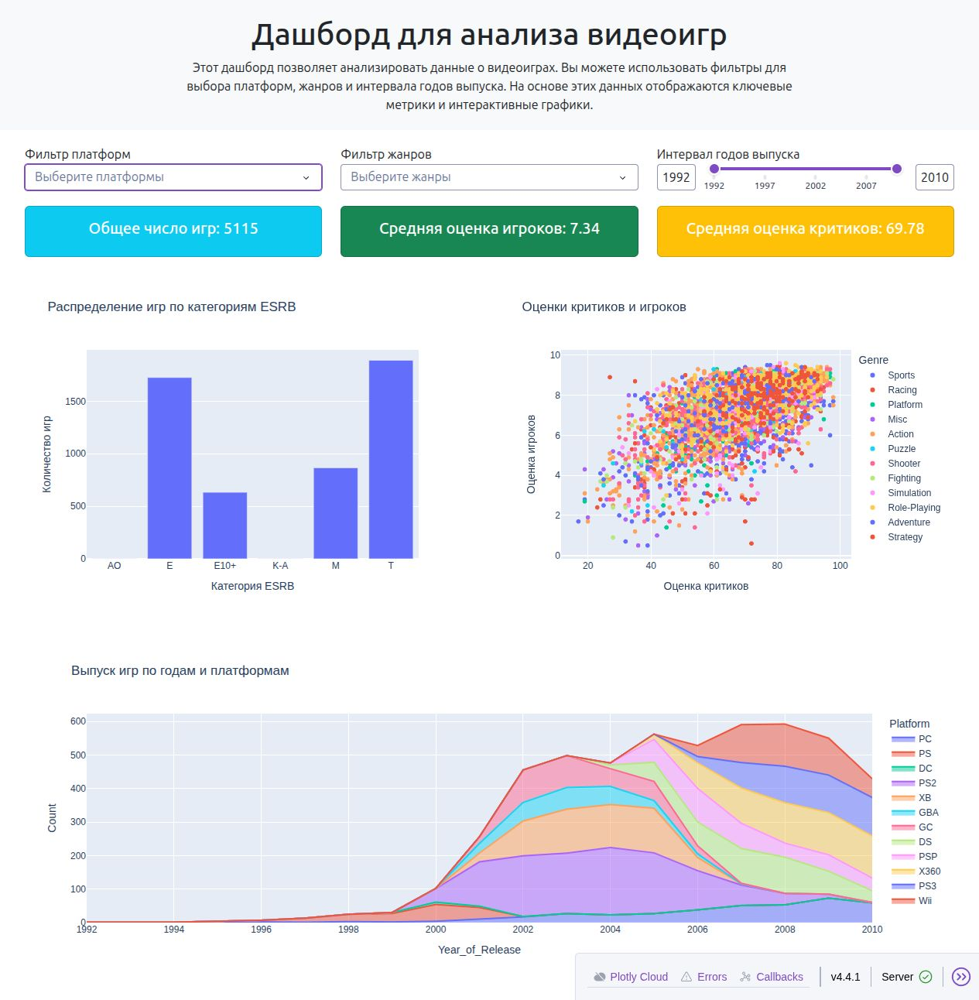

# Аналитика видеоигр

Учебный интерактивный дашборд на Python, Dash и Plotly, подготовленный как
тестовое задание на позицию Junior Data Analyst. Данные находятся в `games.csv`.



## Что показывает дашборд

- Фильтры по платформам, жанрам и годам выпуска.
- Количество игр и средние оценки игроков и критиков в выбранной группе.
- Распределение игр по категориям ESRB — количество записей в каждой категории.
- Соотношение оценок игроков и критиков.
- Динамику количества игр по годам и платформам.

ESRB — категориальный признак: например, E и T. Категории не переводятся
в числовые баллы и не усредняются. Все показатели и графики используют одни
и те же фильтры; пустой список платформ или жанров означает все значения.

## Данные и ограничения

`games.csv` уже включён в репозиторий. Скрипт выбирает период 1990–2010,
приводит год выпуска и оценку пользователя к числам и исключает строки
с пропусками. Поэтому графики описывают только полные записи в этой выборке,
а не весь рынок. Счётчик показывает количество записей «игра — платформа»:
одна игра на нескольких платформах может учитываться несколько раз.

## Запуск локально

Проверено на Python 3.12. Выполняйте команды из папки репозитория: скрипт
читает `games.csv` относительно текущей директории.

```bash
python3 -m venv .venv
source .venv/bin/activate
python -m pip install -r requirements.txt
python games_market_dash_Andrei_Olziatiev.py
```

В Windows вместо `source` используйте `.venv\Scripts\activate`.
Откройте [http://127.0.0.1:8050/](http://127.0.0.1:8050/).
Для остановки нажмите `Ctrl+C` в терминале.

Это локальный сервер разработки. Данные обрабатываются из CSV; подключение
к внешней базе не требуется. Для оформления загружается Bootstrap с CDN.

## Проверка

В активированном виртуальном окружении:

```bash
python -m unittest discover -s tests -p 'test_*.py' -v
```

Тесты проверяют распределение ESRB после применения всех фильтров,
согласованность остальных показателей и обработку пустой выборки.

## Структура

- `games_market_dash_Andrei_Olziatiev.py` — подготовка данных, интерфейс и графики.
- `games.csv` — исходная таблица.
- `requirements.txt` — проверенные версии библиотек приложения.
- `tests/test_dashboard.py` — регрессионные проверки расчётов.
